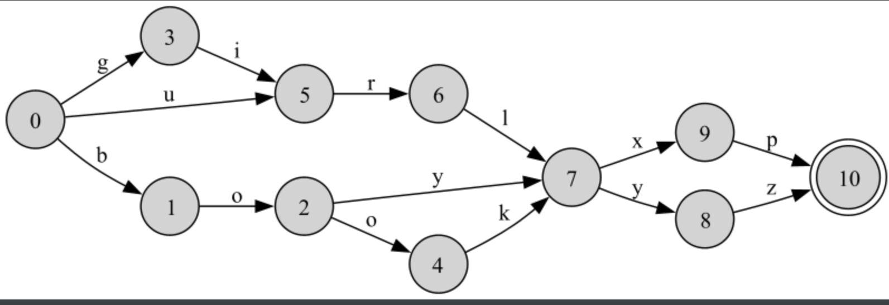
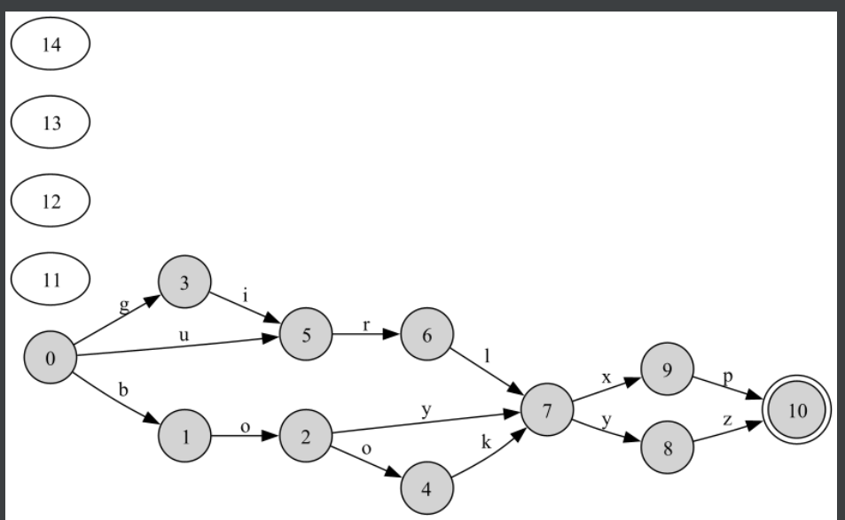
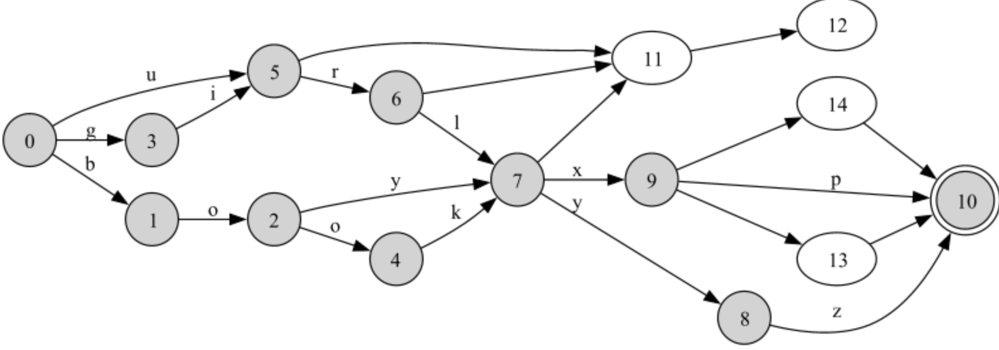

# CSE 464 Project
A Java Program for manipulating graphs in DOT format

### Table of Contents
- Features
- Prerequisites
- Installation
- Testing
- -Outputs

### Features

- Feature 1:
  Reads the input dot file and Outputs the number of nodes and edges in the graph.
- Feature 2:
Implements the add Node function while making sure there are no duplicates
- Feature 3:
Implements add Edge function which adds an edge between source node and destination node while making sure there are no duplicate edges.
- Feature 4:
Outputs the resultant graph in the required format.

Prerequisites:
- Java 8 or higher
- Inteliij 
- Graphviz

### Installation

- git clone https://github.com/pavansai0/CSE-464-2023-pkrish37.git
- Open the folder as new project in Intellij
- Build -> Build Project.

### Testing
- Method Coverage in Testing = 90%
- Line Coverage in Testing = 60%

### Outputs

- Feature 1 Output:The input graph is printed

- Feature 2 Output: Adding Nodes 11,12,13,14 to the graph

- Feature 3 Output: Connecting the newly added nodes using addEdges function

 

