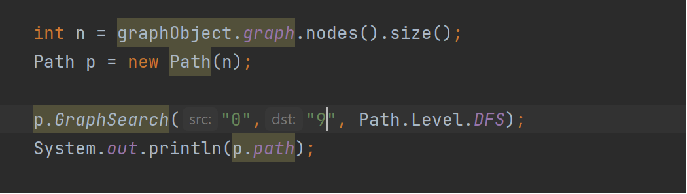

# CSE 464 Project
A Java program to remove ndoe , remove nodes and remove edges

### Table of Contents
- Features
- Prerequisites
- Installation
- Testing
- -Outputs

### Features

- Feature 1:
  removes node
- Feature 2:
removes multiple nodes
- Feature 3:
removes eddges
- Feature 4:
Find a possible path if exists between source and destination using DFS Algorithm.
- Feature 5:
Find a possible path if exists between source and destination using BFS Algorithm

Prerequisites:
- Java 8 or higher
- Inteliij 
- Graphviz

### Installation

- git clone https://github.com/pavansai0/CSE-464-2023-pkrish37.git
- Open the folder as new project in Intellij
- Build -> Build Project.

### Testing
- Method Coverage in Testing = 92%
- Line Coverage in Testing = 84%
- 

### Sample Inputs and Outputs:

 RemoveNode Input 

 Initial Graph
 

 Graph after remvoveNode
 

 RemoveNodes Input
 

 Initial Graph
 

 Graph after remvoveNodes
 

 RemoveEdge Input
 

 Initial Graph
 

 Graph after remvoveNodes
 

 GraphSearch BFS input
 

  GraphSearch BFS output
 

 GraphSearch DFS input
 

  GraphSearch DFS output
 

